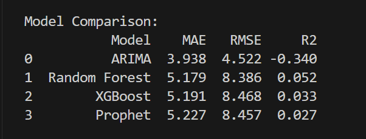

# 🎮 Forecasting Video Game Prices Across Platforms (Steam, PlayStation, Xbox)

## 📝 Project Overview

This project focuses on predicting video game prices using a combination of machine learning and time series forecasting models across multiple platforms—**Steam**, **PlayStation**, and **Xbox**.

We explore price trends and patterns using:
- Classical time series models like **ARIMA**
- Modern tools like **Facebook Prophet**
- Machine learning regressors such as **Random Forest** and **XGBoost**

The dataset used is sourced from **Kaggle's Gaming Profiles 2025** competition.

📂 **Source dataset**:  
https://www.kaggle.com/datasets/artyomkruglov/gaming-profiles-2025-steam-playstation-xbox

---

## 🗃 Dataset Details

- Raw data includes game metadata and price history across 3 platforms.
- Total size is fairly large; due to **hardware limitations**, only **10–15%** of the full dataset is sampled for modeling.
- Features include game names, publishers, platform info, release dates, and USD pricing.

---

## 🧮 Tools & Libraries

- **Languages**: Python 3.x
- **Libraries**:
  - `pandas`, `numpy`, `matplotlib`, `seaborn`
  - `scikit-learn`, `xgboost`, `statsmodels`, `prophet`
  - `psycopg2` (optional, for PostgreSQL access)

---

## 🗄 Data Storage

Data was imported into a local **PostgreSQL** database for better querying and table management during development.

> 💡 **Note**: You can still run this project without a PostgreSQL database by using the raw `.csv` files from the Kaggle dataset.

---

## ⚙️ Models Used

| Model           | Type              | Notes                                              |
|----------------|-------------------|----------------------------------------------------|
| ARIMA           | Time Series       | Basic autoregression with manual tuning            |
| Prophet         | Time Series       | Captures trends and seasonality well               |
| Random Forest   | Regression        | Handles non-linearities, easy to tune              |
| XGBoost         | Regression        | Boosted tree-based model, high performance         |

---

## 📊 Evaluation Metrics

Each model is evaluated using:

- **MAE**: Mean Absolute Error
- **RMSE**: Root Mean Squared Error
- **R² Score**: Coefficient of Determination

These give insight into both prediction error and explanatory power.

---

## 🖼 Output Sample

Here’s a snapshot of the **model comparison results**:

---

📚 Future Improvements
Add hyperparameter optimization (GridSearchCV / Optuna)

Deploy as a Flask/Streamlit app for interactive use

Use full dataset with cloud compute (AWS / Colab Pro)

Try deep learning (LSTM / Temporal Fusion Transformer)

Built with ☕, patience, and a mid-tier laptop that ran out of RAM more than once.
